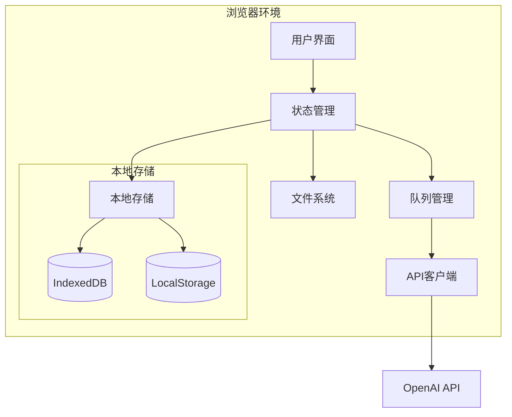
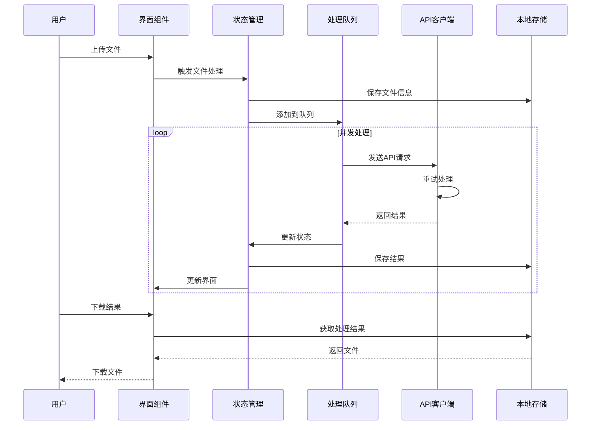

# Architecture for RAG Document Processor

Status: approved

## Technical Summary

RAG文档处理器是一个纯前端的文档批处理工具，专门用于RAG知识库的文档预处理。该应用完全在浏览器端运行，通过调用OpenAI API进行文档处理，支持多种文本格式的批量处理，并提供本地文件管理和处理进度跟踪功能。应用采用现代React技术栈构建，使用TypeScript确保类型安全，通过本地存储实现数据持久化。

## Technology Table

| Technology | Description |
|------------|-------------|
| React 18.3.1 | 前端核心框架 |
| TypeScript 5.5.3 | 开发语言，提供类型安全 |
| Vite 5.4.8 | 现代构建工具，提供快速的开发体验 |
| Tailwind CSS | 原子化CSS框架，用于UI样式开发 |
| Radix UI | 无样式组件库，提供可访问性组件 |
| Zustand | 轻量级状态管理库 |
| React Query | API状态管理和缓存 |
| Axios | HTTP客户端，用于API调用 |
| React Hook Form | 表单管理库 |
| Zod | 类型验证库 |
| IndexedDB | 本地数据存储 |
| LocalStorage | 配置信息存储 |

## Architectural Diagrams

### 系统架构



### 数据流



## Data Models

### 1. 文件模型

```typescript
interface FileInfo {
  id: string;
  name: string;
  size: number;
  type: string;
  lastModified: number;
  content: string;
  status: FileStatus;
  processedContent?: string;
  error?: string;
}

type FileStatus = 'pending' | 'processing' | 'completed' | 'failed';
```

### 2. 智能体配置

```typescript
interface Agent {
  id: string;
  name: string;
  description: string;
  systemPrompt: string;
  temperature: number;
  maxTokens: number;
  model: string;
  active: boolean;
}
```

### 3. 处理配置

```typescript
interface ProcessConfig {
  maxConcurrent: number;
  retryAttempts: number;
  fileConfig: {
    maxFileSize: number;
    defaultFileSize: number;
    allowedTypes: string[];
  };
  apiConfig: {
    baseURL: string;
    timeout: number;
  };
}
```

## Project Structure

```
src/
├── components/           # React组件
│   ├── agents/          # 智能体相关组件
│   │   ├── AgentList.tsx
│   │   ├── AgentForm.tsx
│   │   └── AgentCard.tsx
│   ├── files/           # 文件处理组件
│   │   ├── FileUpload.tsx
│   │   ├── FileList.tsx
│   │   └── ProcessingQueue.tsx
│   ├── settings/        # 设置相关组件
│   └── common/          # 通用组件
├── hooks/               # 自定义Hooks
│   ├── useFileProcess.ts
│   ├── useAgent.ts
│   └── useLocalStorage.ts
├── stores/             # 状态管理
│   ├── fileStore.ts
│   ├── agentStore.ts
│   └── settingsStore.ts
├── api/                # API相关
│   ├── openai.ts
│   └── types.ts
├── utils/              # 工具函数
│   ├── file.ts
│   ├── validation.ts
│   └── format.ts
├── types/              # 类型定义
└── App.tsx             # 应用入口
```

## Infrastructure

### 本地存储架构

1. LocalStorage
   - 存储系统配置
   - 存储智能体配置
   - 存储用户偏好设置

2. IndexedDB
   - 存储文件处理历史
   - 存储处理结果
   - 存储大文件临时数据

### 浏览器兼容性要求

- Chrome >= 90
- Firefox >= 88
- Safari >= 14
- Edge >= 90

## Deployment Plan

1. 开发环境
   ```bash
   npm run dev    # 启动开发服务器
   ```

2. 生产构建
   ```bash
   npm run build  # 构建生产版本
   npm run preview # 预览生产版本
   ```

3. 部署选项
   - GitHub Pages
   - Vercel
   - Netlify
   - 静态文件托管

## Change Log

| Version | Changes | Date |
|---------|---------|------|
| 0.1.0 | 初始架构设计 | 2024-03-xx | 