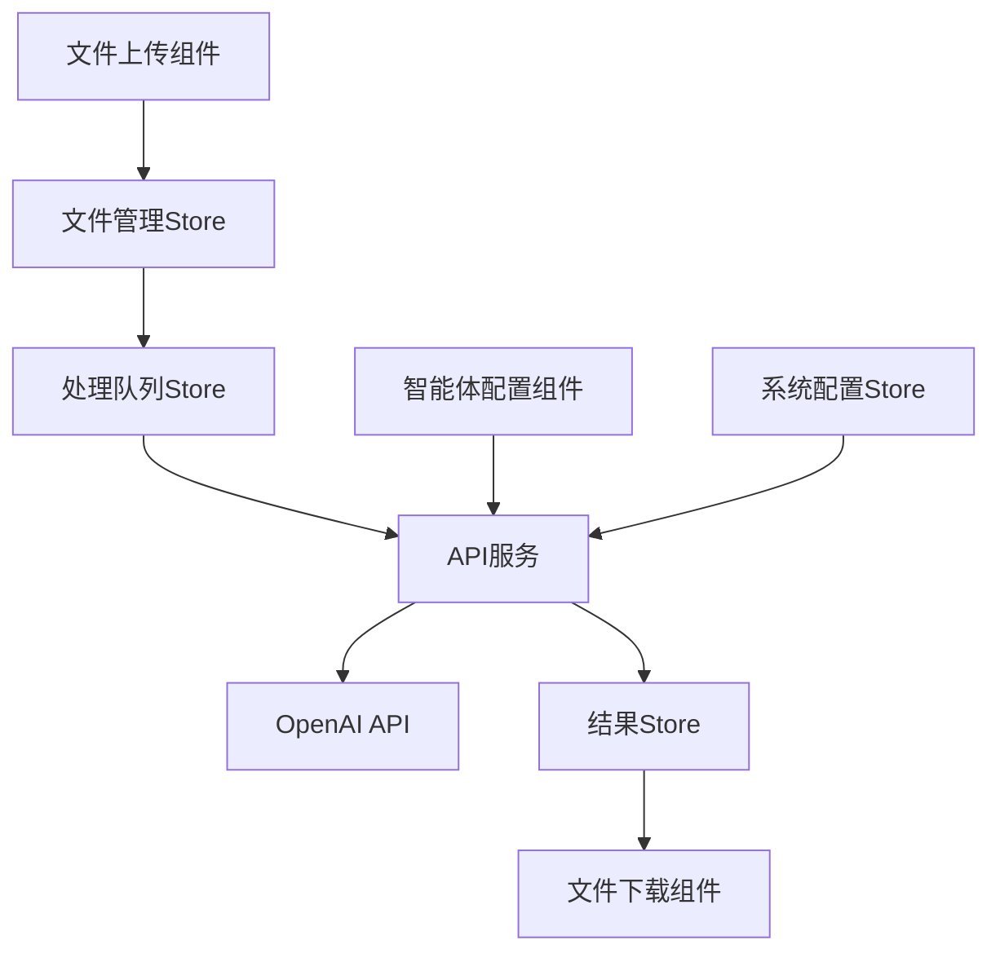
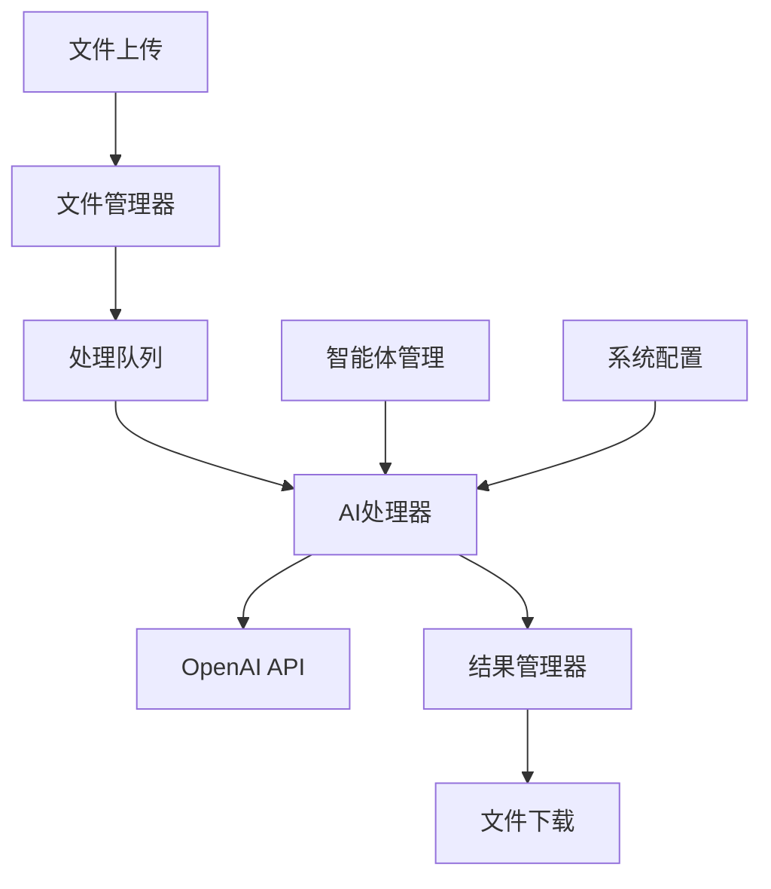
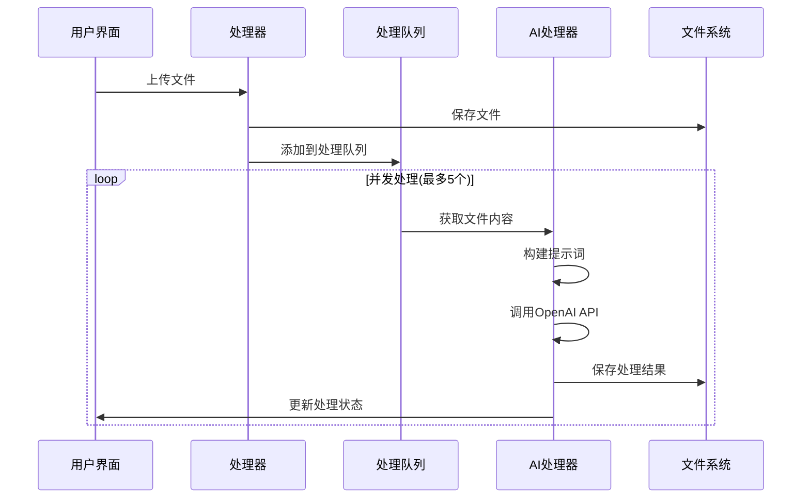

# 1. Title: PRD for RAG Document Processor

<version>1.0.0</version>

## Status: approved

## Intro

统用AI文档批量处理器是一个基于AI的文档批处理工具，专门设计用于RAG（检索增强生成）知识库的文档预处理。它能够帮助个人用户和企业通过自定义的AI智能体批量处理多种格式的文本文件（如md、txt、html等），优化文档结构和内容，使其更适合作为RAG知识库的数据源。用户可以灵活配置AI提示词，自定义处理逻辑，并支持批量上传和处理文件，提高文档预处理效率。

## Goals

- 提供直观的Web界面，支持文件的批量上传和处理
- 支持自定义多个AI智能体，每个智能体可配置不同的处理逻辑
- 实现文件的批量处理和单个处理功能
- 提供便捷的文件下载功能（支持单个和批量）
- 确保处理过程的可靠性和效率

### Success Criteria
- 文件上传响应时间 < 2秒
- 最大并发处理文件数：5个
- UI操作响应时间 < 1秒
- 处理成功率 > 99%

### Key Performance Indicators (KPIs)
- 每日处理文件数量
- 平均文件处理时间
- 系统稳定性指标
- 用户满意度评分

## Features and Requirements

### Functional Requirements

1. **AI智能体管理**
   - 支持创建、编辑、删除AI智能体
   - 每个智能体可配置独立的提示词
   - 智能体列表展示和选择

2. **文件上传与管理**
   - 支持多选上传文件
   - 支持md、txt、html等多种文本格式
   - 文件列表展示和状态管理

3. **文件处理**
   - 支持单个文件处理
   - 支持批量处理（多选/全选）
   - 处理状态实时展示
   - 支持处理结果预览

4. **文件下载**
   - 支持单个文件下载
   - 支持批量文件下载
   - 下载进度展示

5. **系统配置**
   - OpenAI API配置（baseURL和API Key）
   - 系统参数设置

### Non-functional Requirements

1. **性能要求**
   - 异步处理机制，支持后台处理
   - 实时处理状态反馈
   - 支持处理任务的暂停/继续
   - 文件大小限制：
     - 默认限制：2MB
     - 支持自定义配置（通过系统设置）
     - 最大不超过50MB（考虑浏览器内存限制）

2. **可用性要求**
   - 直观的用户界面
   - 清晰的操作反馈
   - 完善的错误提示
   - 处理进度实时展示
   - 支持处理历史记录查看

3. **安全要求**
   - API Key安全存储
   - 文件访问权限控制
   - 本地文件安全处理

## Epic List

### Epic-1: 文件处理核心功能
- 文件上传和验证
- AI处理流程
- 结果输出和下载

### Epic-2: 智能体管理系统
- 智能体配置界面
- 提示词管理
- 处理规则设置

### Epic-3: 进度监控系统
- 实时进度展示
- 状态管理
- 日志记录

### Epic-N: Future Enhancements
- 用户认证系统
- 持久化存储
- 多环境部署支持
- 文件处理模板
- 其他AI模型支持

## Epic 1: Story List

- Story 1: 文件上传与验证
  Status: ''
  Requirements:
  - 实现文件上传组件
  - 支持多种文件格式验证
  - 实现文件列表管理

- Story 2: AI处理流程
  Status: ''
  Requirements:
  - 实现OpenAI API集成
  - 实现并发处理控制
  - 实现处理队列管理

- Story 3: 结果管理
  Status: ''
  Requirements:
  - 实现处理结果保存
  - 实现文件下载功能
  - 实现批量下载支持

## Technology Stack

| Technology | Description |
|------------|-------------|
| React 18.3.1 | 前端核心框架 |
| TypeScript 5.5.3 | 开发语言 |
| Vite 5.4.8 | 构建工具 |
| Tailwind CSS | 样式解决方案 |
| Radix UI | UI组件库 |
| React Hook Form | 表单管理 |
| Zod | 数据验证 |
| Axios | HTTP客户端 |
| Zustand | 状态管理 |
| React Query | 服务端状态管理 |

## Project Structure

```text
src/
├── components/        # UI组件
│   ├── agents/       # AI智能体相关组件
│   ├── files/        # 文件处理相关组件
│   └── common/       # 通用组件
├── hooks/            # 自定义Hook
├── api/             # API接口封装
├── stores/          # 状态管理
├── types/           # TypeScript类型定义
└── utils/           # 工具函数
```

## System Architecture



## 前端状态管理

### 1. 应用状态
```typescript
interface AppState {
  isLoading: boolean;
  error: Error | null;
  config: {
    apiKey: string;
    baseUrl: string;
    maxConcurrent: number;
  }
}
```

### 2. 文件状态
```typescript
interface FileState {
  files: FileInfo[];
  queue: string[];
  processing: string[];
  completed: string[];
  failed: string[];
}
```

### 3. 智能体状态
```typescript
interface AgentState {
  agents: Agent[];
  selectedAgent: string | null;
  isConfiguring: boolean;
}
```

## API集成

### OpenAI API配置
```typescript
interface OpenAIConfig {
  apiKey: string;
  baseURL: string;
  model: string;
  temperature: number;
  maxTokens: number;
}
```

### 错误处理
```typescript
interface APIError {
  status: number;
  message: string;
  details?: any;
}

const handleAPIError = (error: APIError) => {
  // 错误处理逻辑
};
```

### 请求重试策略
```typescript
const retryConfig = {
  retries: 3,
  backoff: {
    initial: 1000,
    multiplier: 2,
    maxRetries: 3
  }
};
```

## Reference

### System Architecture


### File Processing Flow


## Data Models

### Processing Stage
```typescript
enum ProcessingStage {
  QUEUED = '排队中',
  READING = '读取文件',
  PROCESSING = 'AI处理中',
  SAVING = '保存结果',
  COMPLETED = '已完成',
  FAILED = '处理失败'
}
```

### Process Log
```typescript
interface ProcessLog {
  timestamp: string;     // 时间戳
  fileId: string;       // 文件ID
  stage: ProcessingStage; // 处理阶段
  message: string;      // 日志信息
  type: 'info' | 'warning' | 'error'; // 日志类型
  details?: any;        // 详细信息
}
```

## Change Log

| Change | Story ID | Description |
|--------|----------|-------------|
| 初始草案 | N/A | 初始PRD草案 |

## 目标用户与场景

### 目标用户
- 个人用户：需要建立个人知识库的开发者、研究人员、内容创作者等
- 企业用户：需要构建企业级知识库的团队或组织

### 使用场景
1. **知识库文档预处理**
   - 文档结构优化
   - 内容格式标准化
   - 关键信息提取和重组
   - 文档质量提升

2. **批量文档处理**
   - 大量历史文档的标准化处理
   - 新增文档的快速预处理
   - 多格式文档的统一处理

## 功能需求

### 核心功能

1. **AI智能体管理**
   - 支持创建、编辑、删除AI智能体配置
   - 每个智能体可配置独立的提示词
   - 智能体配置本地存储
   - 智能体列表展示和选择

2. **文件上传与管理**
   - 支持多选上传文件
   - 支持md、txt、html等多种文本格式
   - 文件列表展示和状态管理
   - 文件在前端进行处理，不上传服务器

3. **文件处理**
   - 支持单个文件处理
   - 支持批量处理（多选/全选）
   - 处理状态实时展示
   - 支持处理结果预览
   - 进度展示功能：
     - 总体处理进度
     - 单个文件处理进度
     - 处理速度和剩余时间估算
     - 处理文件数量统计
   - 所有处理在浏览器端完成

4. **文件下载**
   - 支持单个文件下载到本地
   - 支持批量文件打包下载
   - 下载进度展示
   - 使用浏览器原生下载功能

5. **系统配置**
   - OpenAI API配置（baseURL和API Key）
   - 系统参数设置
   - 配置信息本地存储

### 非功能需求

1. **性能要求**
   - 文件处理在浏览器端进行
   - 支持大文件分片处理
   - 最大并发API请求数：5个
   - UI响应时间 < 100ms
   - 实时处理状态反馈
   - 支持处理任务的暂停/继续
   - 文件大小限制：
     - 默认限制：2MB
     - 支持自定义配置（通过系统设置）
     - 最大不超过50MB（考虑浏览器内存限制）

2. **可用性要求**
   - 响应式界面设计
   - 离线功能支持
   - 清晰的操作反馈
   - 完善的错误提示
   - 处理进度实时展示
   - 支持处理历史记录查看（本地存储）

3. **安全要求**
   - API Key本地加密存储
   - 文件本地处理，不上传服务器
   - 敏感信息不进行网络传输
   - 使用HTTPS调用OpenAI API

4. **浏览器兼容性**
   - 支持主流现代浏览器
   - Chrome/Firefox/Safari最新版
   - Edge最新版
   - 不支持IE浏览器

5. **本地存储管理**
   - 使用LocalStorage存储配置
   - 使用IndexedDB存储处理历史
   - 定期清理过期数据
   - 提供清除本地数据功能

## 技术栈

| 技术 | 描述 |
|------|------|
| React 18.3.1 | 前端核心框架 |
| TypeScript 5.5.3 | 开发语言 |
| Vite 5.4.8 | 构建工具 |
| Tailwind CSS | 样式解决方案 |
| Radix UI | UI组件库 |
| React Hook Form | 表单管理 |
| Zod | 数据验证 |

## 项目结构

```text
src/
├── components/        # UI组件
│   ├── agents/       # AI智能体相关组件
│   ├── files/        # 文件处理相关组件
│   └── common/       # 通用组件
├── hooks/            # 自定义Hook
├── services/         # API服务
├── stores/           # 状态管理
└── utils/            # 工具函数
```

## 变更日志

| 变更 | Story ID | 描述 |
|------|----------|------|
| 初始草案 | N/A | 初始PRD草案 | 

## MVP范围

### 包含功能
1. 基础文件上传和下载
2. AI智能体配置和管理
3. 异步文件处理（最多5个并发）
4. 基本的处理状态展示
5. OpenAI API配置

### 暂不包含
1. 用户认证系统
2. 持久化存储
3. 多环境部署支持
4. 文件处理模板
5. 其他AI模型支持

## 系统架构


## 错误处理策略

### 日志记录
- 记录文件处理的全过程日志
- 记录API调用的响应和错误信息
- 记录系统运行状态和性能指标

### 错误处理机制
1. **文件处理错误**
   - 记录具体错误信息和堆栈跟踪
   - 标记失败的文件，支持重试
   - 不影响其他文件的处理继续进行

2. **API调用错误**
   - 记录API错误响应
   - 实现请求重试机制
   - 处理API限流情况

3. **系统错误**
   - 记录系统资源使用情况
   - 监控并发处理状态
   - 记录性能瓶颈信息

### 5. 本地存储设计

```typescript
// LocalStorage结构
interface LocalConfig {
  apiKey: string;
  baseUrl: string;
  agents: Agent[];
  processConfig: ProcessConfig;
  fileConfig: {
    maxFileSize: number;      // 最大文件大小（字节）
    defaultFileSize: number;  // 默认为 2MB
    allowedTypes: string[];   // 允许的文件类型
  };
}

// IndexedDB结构
interface ProcessHistory {
  id: string;
  timestamp: number;
  fileInfo: FileStatus;
  result: string;
  processingTime: number;
  tokenUsage: {
    prompt: number;
    completion: number;
    total: number;
  };
}
```

### 6. 错误处理机制

```typescript
// 错误类型定义
type ErrorType = 
  | 'FILE_TOO_LARGE'
  | 'INVALID_FORMAT'
  | 'API_ERROR'
  | 'TIMEOUT'
  | 'RATE_LIMIT'
  | 'UNKNOWN';

// 文件大小相关错误处理
interface FileSizeError {
  code: 'FILE_TOO_LARGE';
  filename: string;
  fileSize: number;
  maxAllowedSize: number;
  message: string;
}

// 错误处理策略
const errorHandlers = {
  FILE_TOO_LARGE: (error: FileSizeError) => {
    // 文件过大处理逻辑
    return {
      type: 'error',
      message: `文件 ${error.filename} (${formatFileSize(error.fileSize)}) 超过大小限制 ${formatFileSize(error.maxAllowedSize)}`,
      suggestion: '请减小文件大小或在系统设置中调整限制'
    };
  },
  API_ERROR: async (error) => {
    // API错误重试逻辑
  },
  RATE_LIMIT: async () => {
    // 限流处理逻辑
  }
};

// 文件大小格式化工具
function formatFileSize(bytes: number): string {
  if (bytes < 1024) return bytes + ' B';
  if (bytes < 1024 * 1024) return (bytes / 1024).toFixed(2) + ' KB';
  return (bytes / (1024 * 1024)).toFixed(2) + ' MB';
}
```

### 系统设置界面

```typescript
interface SystemSettings {
  // 文件处理设置
  fileProcessing: {
    maxFileSize: number;        // 最大文件大小配置
    defaultFileSize: number;    // 默认文件大小限制（2MB）
    warningSizeThreshold: number; // 警告阈值（默认1.5MB）
    allowedFileTypes: string[]; // 允许的文件类型
  };
  // ... other settings ...
}

// 文件大小配置组件
interface FileSizeConfig {
  currentLimit: number;
  defaultLimit: number;
  maxLimit: number;
  onLimitChange: (newLimit: number) => void;
  showWarningThreshold: boolean;
  warningThreshold: number;
}
```

