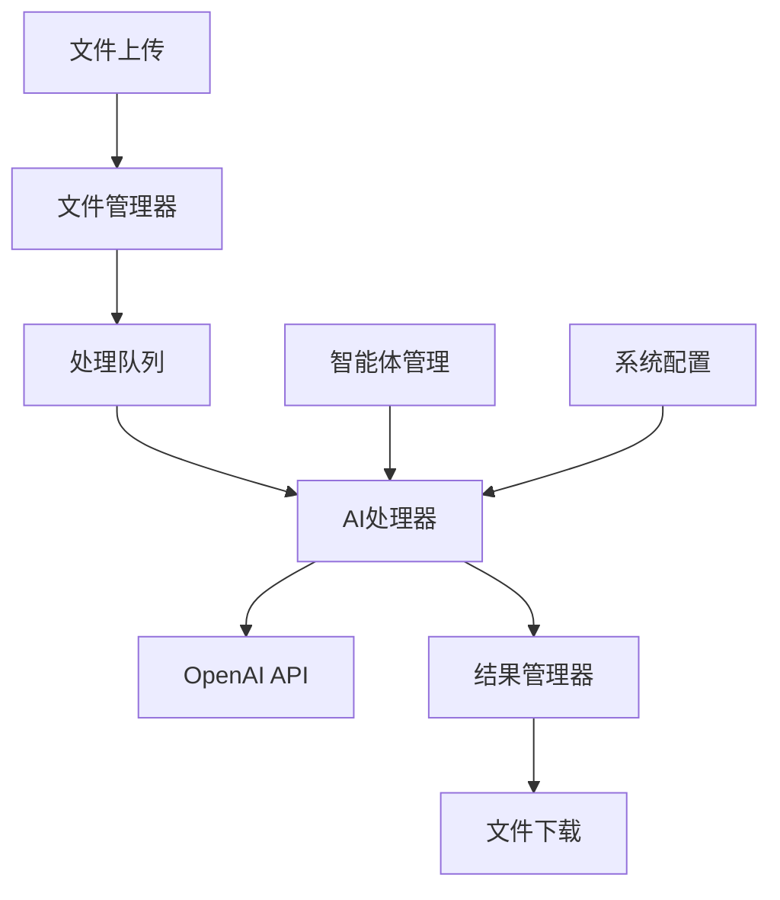
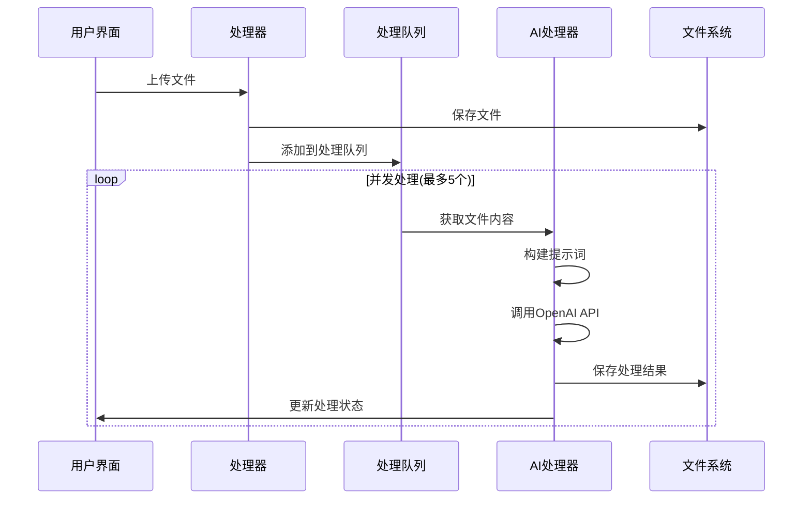
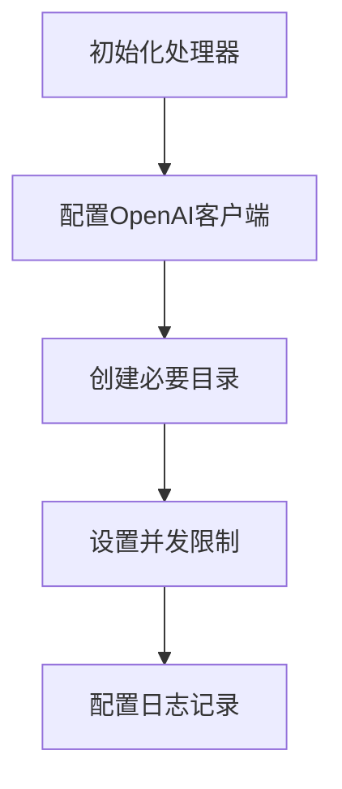
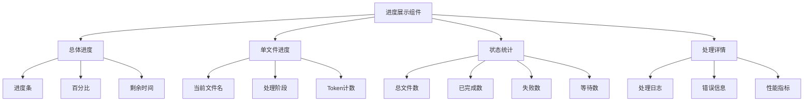

# 1. Title: PRD for RAG Document Processor

<version>1.0.0</version>

## Status: Draft

## Intro

RAG文档处理器是一个基于AI的文档批处理工具，专门设计用于RAG（检索增强生成）知识库的文档预处理。它能够帮助个人用户和企业通过自定义的AI智能体批量处理多种格式的文本文件（如md、txt、html等），优化文档结构和内容，使其更适合作为RAG知识库的数据源。用户可以灵活配置AI提示词，自定义处理逻辑，并支持批量上传和处理文件，提高文档预处理效率。

## Goals

- 提供直观的Web界面，支持文件的批量上传和处理
- 支持自定义多个AI智能体，每个智能体可配置不同的处理逻辑
- 实现文件的批量处理和单个处理功能
- 提供便捷的文件下载功能（支持单个和批量）
- 确保处理过程的可靠性和效率

### Success Criteria
- 文件上传响应时间 < 2秒
- 最大并发处理文件数：5个
- UI操作响应时间 < 1秒
- 处理成功率 > 99%

### Key Performance Indicators (KPIs)
- 每日处理文件数量
- 平均文件处理时间
- 系统稳定性指标
- 用户满意度评分

## Features and Requirements

### Functional Requirements

1. **AI智能体管理**
   - 支持创建、编辑、删除AI智能体
   - 每个智能体可配置独立的提示词
   - 智能体列表展示和选择

2. **文件上传与管理**
   - 支持多选上传文件
   - 支持md、txt、html等多种文本格式
   - 文件列表展示和状态管理

3. **文件处理**
   - 支持单个文件处理
   - 支持批量处理（多选/全选）
   - 处理状态实时展示
   - 支持处理结果预览

4. **文件下载**
   - 支持单个文件下载
   - 支持批量文件下载
   - 下载进度展示

5. **系统配置**
   - OpenAI API配置（baseURL和API Key）
   - 系统参数设置

### Non-functional Requirements

1. **性能要求**
   - 异步处理机制，支持后台处理
   - 实时处理状态反馈
   - 支持处理任务的暂停/继续
   - 文件大小：暂不限制

2. **可用性要求**
   - 直观的用户界面
   - 清晰的操作反馈
   - 完善的错误提示
   - 处理进度实时展示
   - 支持处理历史记录查看

3. **安全要求**
   - API Key安全存储
   - 文件访问权限控制
   - 本地文件安全处理

## Epic List

### Epic-1: 文件处理核心功能
- 文件上传和验证
- AI处理流程
- 结果输出和下载

### Epic-2: 智能体管理系统
- 智能体配置界面
- 提示词管理
- 处理规则设置

### Epic-3: 进度监控系统
- 实时进度展示
- 状态管理
- 日志记录

### Epic-N: Future Enhancements
- 用户认证系统
- 持久化存储
- 多环境部署支持
- 文件处理模板
- 其他AI模型支持

## Epic 1: Story List

- Story 1: 文件上传与验证
  Status: ''
  Requirements:
  - 实现文件上传组件
  - 支持多种文件格式验证
  - 实现文件列表管理

- Story 2: AI处理流程
  Status: ''
  Requirements:
  - 实现OpenAI API集成
  - 实现并发处理控制
  - 实现处理队列管理

- Story 3: 结果管理
  Status: ''
  Requirements:
  - 实现处理结果保存
  - 实现文件下载功能
  - 实现批量下载支持

## Technology Stack

| Technology | Description |
|------------|-------------|
| React 18.3.1 | 前端核心框架 |
| TypeScript 5.5.3 | 开发语言 |
| Vite 5.4.8 | 构建工具 |
| Tailwind CSS | 样式解决方案 |
| Radix UI | UI组件库 |
| React Hook Form | 表单管理 |
| Zod | 数据验证 |

## Reference

### System Architecture


### File Processing Flow


## Data Models

### Processing Stage
```typescript
enum ProcessingStage {
  QUEUED = '排队中',
  READING = '读取文件',
  PROCESSING = 'AI处理中',
  SAVING = '保存结果',
  COMPLETED = '已完成',
  FAILED = '处理失败'
}
```

### Process Log
```typescript
interface ProcessLog {
  timestamp: string;     // 时间戳
  fileId: string;       // 文件ID
  stage: ProcessingStage; // 处理阶段
  message: string;      // 日志信息
  type: 'info' | 'warning' | 'error'; // 日志类型
  details?: any;        // 详细信息
}
```

## Project Structure

```text
src/
├── components/        # UI组件
│   ├── agents/       # AI智能体相关组件
│   ├── files/        # 文件处理相关组件
│   └── common/       # 通用组件
├── hooks/            # 自定义Hook
├── services/         # API服务
├── stores/           # 状态管理
└── utils/            # 工具函数
```

## Change Log

| Change | Story ID | Description |
|--------|----------|-------------|
| 初始草案 | N/A | 初始PRD草案 |

## 目标用户与场景

### 目标用户
- 个人用户：需要建立个人知识库的开发者、研究人员、内容创作者等
- 企业用户：需要构建企业级知识库的团队或组织

### 使用场景
1. **知识库文档预处理**
   - 文档结构优化
   - 内容格式标准化
   - 关键信息提取和重组
   - 文档质量提升

2. **批量文档处理**
   - 大量历史文档的标准化处理
   - 新增文档的快速预处理
   - 多格式文档的统一处理

## 功能需求

### 核心功能

1. **AI智能体管理**
   - 支持创建、编辑、删除AI智能体
   - 每个智能体可配置独立的提示词
   - 智能体列表展示和选择

2. **文件上传与管理**
   - 支持多选上传文件
   - 支持md、txt、html等多种文本格式
   - 文件列表展示和状态管理

3. **文件处理**
   - 支持单个文件处理
   - 支持批量处理（多选/全选）
   - 处理状态实时展示
   - 支持处理结果预览
   - 进度展示功能：
     - 总体处理进度
     - 单个文件处理进度
     - 处理速度和剩余时间估算
     - 处理文件数量统计

4. **文件下载**
   - 支持单个文件下载
   - 支持批量文件下载
   - 下载进度展示

5. **系统配置**
   - OpenAI API配置（baseURL和API Key）
   - 系统参数设置

### 非功能需求

1. **性能要求**
   - 文件上传响应时间 < 2秒
   - 异步处理机制，支持后台处理
   - 最大并发处理文件数：5个
   - UI操作响应时间 < 1秒
   - 实时处理状态反馈
   - 支持处理任务的暂停/继续
   - 文件大小：暂不限制

2. **可用性要求**
   - 直观的用户界面
   - 清晰的操作反馈
   - 完善的错误提示
   - 处理进度实时展示
   - 支持处理历史记录查看

3. **安全要求**
   - API Key安全存储
   - 文件访问权限控制
   - 本地文件安全处理

## 技术栈

| 技术 | 描述 |
|------|------|
| React 18.3.1 | 前端核心框架 |
| TypeScript 5.5.3 | 开发语言 |
| Vite 5.4.8 | 构建工具 |
| Tailwind CSS | 样式解决方案 |
| Radix UI | UI组件库 |
| React Hook Form | 表单管理 |
| Zod | 数据验证 |

## 项目结构

```text
src/
├── components/        # UI组件
│   ├── agents/       # AI智能体相关组件
│   ├── files/        # 文件处理相关组件
│   └── common/       # 通用组件
├── hooks/            # 自定义Hook
├── services/         # API服务
├── stores/           # 状态管理
└── utils/            # 工具函数
```

## 变更日志

| 变更 | Story ID | 描述 |
|------|----------|------|
| 初始草案 | N/A | 初始PRD草案 | 

## MVP范围

### 包含功能
1. 基础文件上传和下载
2. AI智能体配置和管理
3. 异步文件处理（最多5个并发）
4. 基本的处理状态展示
5. OpenAI API配置

### 暂不包含
1. 用户认证系统
2. 持久化存储
3. 多环境部署支持
4. 文件处理模板
5. 其他AI模型支持

## 系统架构


## 错误处理策略

### 日志记录
- 记录文件处理的全过程日志
- 记录API调用的响应和错误信息
- 记录系统运行状态和性能指标

### 错误处理机制
1. **文件处理错误**
   - 记录具体错误信息和堆栈跟踪
   - 标记失败的文件，支持重试
   - 不影响其他文件的处理继续进行

2. **API调用错误**
   - 记录API错误响应
   - 实现请求重试机制
   - 处理API限流情况

3. **系统错误**
   - 记录系统资源使用情况
   - 监控并发处理状态
   - 记录性能瓶颈信息

## 文件处理流程

### 1. 初始化阶段


### 2. 文件处理流程


### 3. 处理步骤详解

1. **文件上传与验证**
   - 支持的文件格式：`.txt`, `.md`, `.doc`, `.docx`, `.rtf`, `.html`, `.htm`
   - 文件编码：UTF-8
   - 文件大小验证

2. **队列管理**
   - 使用信号量控制并发（最大5个）
   - 任务优先级排序
   - 处理进度跟踪

3. **AI处理**
   - 系统提示词：`"你是一个专业的文本优化助手。"`
   - 模型参数：
     ```json
     {
       "temperature": 0.7,
       "max_tokens": 4096
     }
     ```
   - API请求间隔：1秒（避免限流）

4. **结果保存**
   - 输出格式：统一使用`.md`
   - 文件命名：`{原文件名}_processed_{时间戳}.md`
   - 异步写入操作

### 4. 状态管理

| 状态 | 描述 | 处理方式 |
|------|------|----------|
| 待处理 | 文件已上传，等待处理 | 进入处理队列 |
| 处理中 | 正在进行AI处理 | 显示进度条 |
| 已完成 | 处理完成并保存 | 可下载结果 |
| 失败 | 处理过程出错 | 显示错误信息，支持重试 | 

### 5. 进度展示详细设计

#### 5.1 进度展示组件



#### 5.2 进度展示内容

1. **总体进度展示**
   - 总进度条（0-100%）
   - 已处理文件数/总文件数
   - 预估剩余时间
   - 当前处理速度（文件/分钟）

2. **单文件进度展示**
   - 文件名和大小
   - 处理阶段标识：
     ```typescript
     enum ProcessingStage {
       QUEUED = '排队中',
       READING = '读取文件',
       PROCESSING = 'AI处理中',
       SAVING = '保存结果',
       COMPLETED = '已完成',
       FAILED = '处理失败'
     }
     ```
   - Token使用统计：
     - 已使用token数
     - 预估剩余token数
     - Token使用费用估算

3. **状态统计面板**
   | 状态 | 显示内容 | 更新频率 |
   |------|----------|----------|
   | 队列统计 | 等待处理文件数 | 实时 |
   | 处理统计 | 正在处理文件数 | 实时 |
   | 完成统计 | 已完成文件数/总数 | 实时 |
   | 性能统计 | 平均处理时间/文件 | 定期更新 |

4. **实时日志展示**
   ```typescript
   interface ProcessLog {
     timestamp: string;     // 时间戳
     fileId: string;       // 文件ID
     stage: ProcessingStage; // 处理阶段
     message: string;      // 日志信息
     type: 'info' | 'warning' | 'error'; // 日志类型
     details?: any;        // 详细信息
   }
   ```

#### 5.3 交互设计

1. **进度条交互**
   - 支持暂停/继续处理
   - 支持取消处理
   - 鼠标悬停显示详细信息

2. **文件列表交互**
   - 支持按状态筛选
   - 支持按处理时间排序
   - 支持展开/折叠详细信息

3. **日志面板交互**
   - 支持日志级别筛选
   - 支持搜索特定文件
   - 支持导出处理日志

#### 5.4 更新机制

1. **实时更新**
   - 使用WebSocket保持实时连接
   - 定期（每秒）更新进度信息
   - 即时推送错误和完成通知

2. **性能优化**
   - 分批次更新UI，避免性能问题
   - 大量文件时采用虚拟滚动
   - 日志采用增量更新机制
